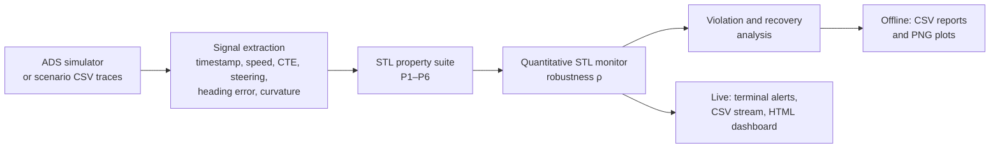

# 🚗 STL-Based Safety Assurance Framework for Autonomous Systems 

> Runtime verification for autonomous-driving simulations using Signal Temporal Logic (STL).

This project is an offline STL robustness monitor over simulation
traces originally collected for [*Coverage-Guided Road Selection and
Prioritization for Efficient Testing in ADS*](https://arxiv.org/abs/2601.08609).
Using the same Udacity self-driving car simulator data with the
NVIDIA Dave-2 model as the system under test, it adds a formal
temporal-analysis layer on top of that empirical test campaign —
mapping scenario-based ADS testing outcomes to STL robustness and
bridging simulation-driven V&V with formal specification-based
evaluation.

## 🎯 Problem

Scenario-based ADS testing can reveal that a drive passed or failed,
but it does not by itself specify *which temporal safety requirement*
was breached, when the breach occurred, how long it lasted, or how far
the agent was from satisfying the requirement. This project addresses
that gap by evaluating measured driving signals against Signal
Temporal Logic (STL) specifications and producing a quantitative
robustness score for every scenario.

The monitor provides:

1. **Specification layer** — encode expected ADS behavior as STL
   formulas over measured signals (speed, CTE, steering, heading,
   curvature).
2. **Quantitative verdicts** — replace binary pass/fail with a
   robustness score `ρ`, so each scenario has a measurable
   satisfaction margin.
3. **Post-hoc formal analysis** — compute violation timing,
   violation duration, recovery behavior, and aggregate summaries
   over the full scenario corpus.

## 🏗️ Architecture

The monitor supports the same evaluation pipeline for stored traces
and for signals received while a simulation is running.



Core modules: [`stl_monitor.py`](./stl_monitor.py) implements STL
signals, formulas, and robustness semantics; [`ads_properties.py`](./ads_properties.py)
defines the six ADS properties; [`runner.py`](./runner.py) performs
offline batch analysis; and [`realtime_monitor.py`](./realtime_monitor.py)
records and presents live monitor results.

---

## ⚙️ Monitoring modes

### 📁 Offline analysis

Evaluate completed CSV traces to produce per-road robustness scores,
violation timing, summary tables, and plots.

```bash
python runner.py --data_dir ./dynamic_data --recursive --output_dir ./results
```

### 📡 Real-time verification

Evaluate properties while the simulator runs, with terminal alerts,
CSV logging, and an auto-refreshing HTML dashboard.

```bash
# Terminal view only
python ../main.py --stl-live-view terminal

# HTML dashboard auto-opens in browser
python ../main.py --stl-live-view html

# Both terminal and browser (recommended)
python ../main.py --stl-live-view both
```

---

## 🛡️ STL property suite

The monitor evaluates six temporal safety and performance properties:

| Metric | Meaning |
|--------|---------|
| `P1_lane_keeping` | Lane-keeping property: `abs(cte) < 1.0`, with a 0.5 s sustained-violation filter |
| `P2_speed_stability` | Speed property: `speed > 5` after a 2 s warm-up |
| `P3_steering_smoothness` | Steering property: `abs(str_angle) < 0.75`, with a 0.5 s sustained-violation filter |
| `P4_heading_alignment` | Heading property: `abs(hdg_err) < 0.25` after 0.5 s |
| `P5_recovery` | Recovery property: if `abs(cte) > 0.5`, return to `abs(cte) < 0.35` within 5 s |
| `P6_curvature_safety` | Curvature property: if `abs(curvature) > 0.05`, keep `abs(cte) < 0.6` |

Additional derived metrics, including CTE spikes, recovery rates, and
steering/throttle jerk, are written to the offline analysis reports.

### How verdicts work

Each property is evaluated as a robustness score `ρ` — a single real
number summarizing how strongly the property is satisfied on a given
trace. The sign is the verdict:

- `ρ > 0` → satisfied (the larger, the more "slack")
- `ρ < 0` → violated (the more negative, the worse)
- `ρ = 0` → right on the boundary

Properties combine threshold predicates with Boolean logic and `G`
(globally) / `F` (eventually) temporal operators. For example, P5 is
`G(drifting → F[0,5](recovered))`: every drift must recover within five
seconds.

The full quantitative semantics follow Donzé & Maler (2010).

## 🧠 Approach and libraries

The project uses quantitative STL robustness monitoring plus
violation-segment and recovery analysis. It is implemented with
**NumPy**, **pandas**, **Matplotlib**, and the Python standard library;
the STL semantics are implemented locally—no external STL library is
required.

## 🚀 Setup and run

### Prerequisites

Use Python 3.9 or newer. Create and activate an isolated environment:

```bash
python3 -m venv .venv
source .venv/bin/activate
pip install -r requirements.txt
```

### 1. Run offline analysis

Evaluate the included sample traces first:

```bash
python runner.py --data_dir ./sample_data --output_dir ./results
```

To evaluate a full corpus, point `--data_dir` to a directory of CSV
traces and add `--recursive` when traces are stored in subdirectories:

```bash
# Recursively evaluate scenario folders (e.g. dynamic_data/a*/**/*.csv)
python runner.py --data_dir ./dynamic_data --recursive --output_dir ./results
```

Each trace must contain a `timestamp` column and the signals used by
the property suite: `speed`, `cte`, `str_angle`, `hdg_err`, and
`curvature`. The optional `throttle` column enables throttle-jerk
metrics. See [`sample_data/0.csv`](./sample_data/0.csv) for the input
format.

### 2. Run real-time monitoring

Run the main simulation with STL live verification:

```bash
# From parent directory
cd ..

# Run with terminal STL output
python main.py --num-episodes 10 --stl-live-view terminal

# Run with auto-opening HTML dashboard
python main.py --num-episodes 10 --stl-live-view html

# Run with both (recommended for full observability)
python main.py --num-episodes 10 --stl-live-view both

```

Live monitoring is integrated with the simulator project's `main.py`,
which is expected in the parent directory. The standalone repository
can run offline analysis without that project.

<details>
<summary><strong>Real-time CLI options</strong></summary>

| Flag | Values | Default | Purpose |
|------|--------|---------|----------|
| `--stl-live-view` | `terminal` \| `html` \| `both` | `both` | How to display real-time STL results |
| `--stl-print-every` | integer | `25` | Print terminal summary every N steps |
| `--stl-html-refresh-steps` | integer | `25` | Refresh HTML dashboard every N steps |
| `--stl-alert-threshold` | float | `0.0` | Robustness threshold for violation alerts (ρ < threshold) |
| `--stl-no-auto-open-dashboard` | flag | not set | Do not auto-open HTML dashboard in browser |
| `--disable-real-time-stl` | flag | not set | Disable real-time STL monitoring entirely |

</details>

## 🖥️ Live dashboard


*Real-time STL verification with live terminal alerts and auto-refreshing HTML dashboard. The dashboard displays per-step robustness scores (ρ) and violation status for all six STL properties as the agent drives.*

---

## 📦 Outputs

### Offline analysis

| File | Format | Content |
|------|--------|---------|
| `results.csv` | one row per road | per-property `*_rho` and `*_ok`, plus all derived metrics |
| `violations_detailed.csv` | one row per violation segment | `road_id`, `property`, `segment_id`, `start_time_s`, `end_time_s`, `duration_s` |
| `violations_summary.csv` | one row per (road, property) | `violated`, `violation_segments`, `total_violation_duration_s` |
| `summary_*.csv` | summary tables | aggregate property, metric, and risk summaries |
| `*.png` | plots | robustness heatmaps, violation rates, and selected road traces |

### Real-time monitoring

The following files are written to the live monitor's configured output directory:

| File | Format | Content |
|------|--------|----------|
| `realtime_stream.csv` | append-only | per-step signal values and robustness scores |
| `realtime_alerts.csv` | append-only | violation transitions (when ρ crosses 0) |
| `realtime_episode_summary.csv` | append-only | per-episode verdict and max violation counts |
| `realtime_dashboard.html` | live HTML | auto-refreshing browser dashboard with plots |

## 📚 Citation

The simulation traces used here were originally collected for:

> *Coverage-Guided Road Selection and Prioritization for Efficient
> Testing in ADS.* arXiv:2601.08609.
> [https://arxiv.org/abs/2601.08609](https://arxiv.org/abs/2601.08609)

The STL robustness layer in this repository follows:

> A. Donzé and O. Maler, "Robust Satisfaction of Temporal Logic over
> Real-Valued Signals," *Formal Modeling and Analysis of Timed
> Systems*, 2010.
